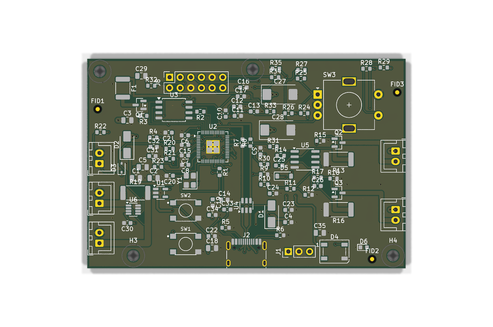
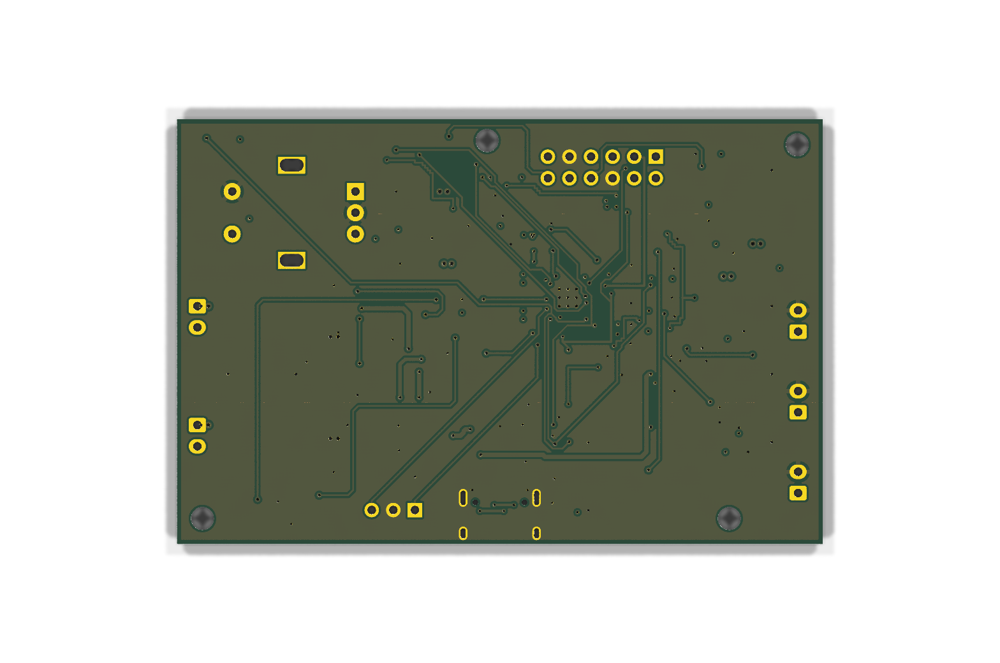
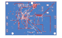
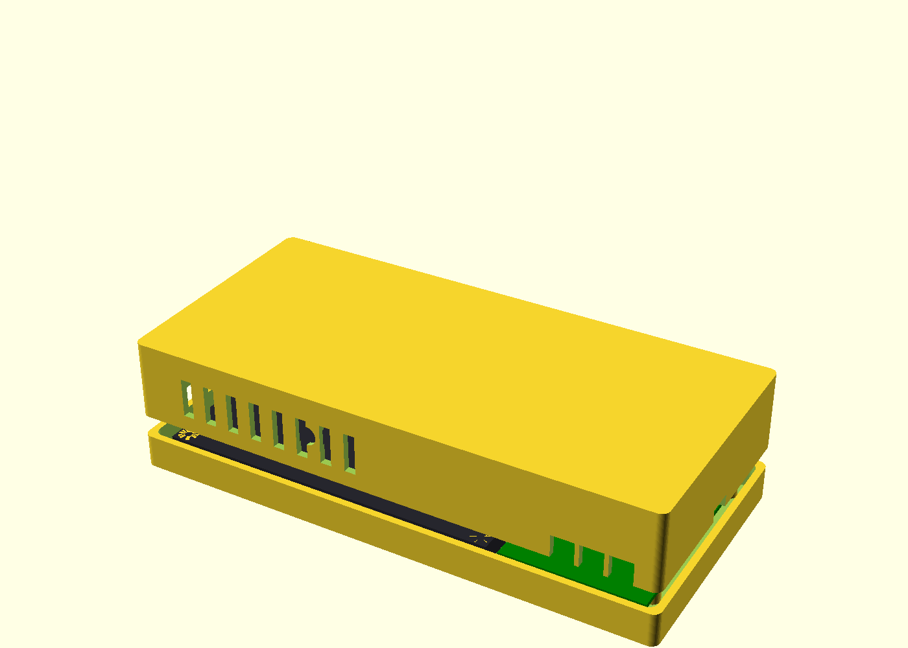

# WiggleCam Camera Controller

A 4-layer RP2040 co-processor board for a 4-lens wigglegram camera.
It sits between a Raspberry Pi 5 (which does all capture and image
processing) and the camera's physical hardware, handling the
real-time/analog work: constant-current LED flash driving with
hardware-enforced safety limits, shutter debounce, rotary-encoder
decoding, battery telemetry (INA219), and a camera-sync trigger line —
exposed to the Pi over I2C (slave 0x17, primary) and UART (fallback)
through a 2×6 header that maps 1:1 onto Pi 5 GPIO pins 1–12.

The board was laid out and routed by hand in KiCad: components placed
by function, the critical nets (RP2040 fan-out, QSPI flash bus, USB
differential pair, crystal, flash-current loop) routed first, then the
low-speed GPIO worked in around them, with solid GND and split
3V3/VLED planes on the inner layers. It clears DRC at JLCPCB 4-layer
capability limits, and the key clearances and current-carrying widths
are measured against published design guidance in the verification
report. The schematic is captured as code (SKiDL, ERC-clean).

Signal routing — front copper in red, back copper in blue (the GND and
power planes on the inner layers are hidden for readability):

## Status

| Stage | Result |
|-------|--------|
| Schematic (SKiDL) | ERC clean — 0 errors, 0 warnings |
| Layout | 76×50 mm 4-layer (Sig / GND / 3V3+VLED / Sig), fully routed |
| DRC (JLCPCB 4-layer rules, zones refilled) | **0 violations, 0 unconnected** |
| Verification report | 24 measured checks: no FAILs; deviations analyzed and dispositioned — [docs/verification-report.md](docs/verification-report.md) |
| Firmware (Pico SDK, C) | builds clean → `camctrl.uf2` |
| Fab outputs | Gerbers + drill + BOM + CPL in [fab/](fab/) — every SMT line carries a verified LCSC number (2026-07-03); THT connectors are hand-solder |

## Repository layout

| Path | Contents |
|------|----------|
| [hardware/skidl/](hardware/skidl/) | schematic as code (one module per block, datasheet pin maps inline) |
| [hardware/kicad/](hardware/kicad/) | the routed board (`wigglecam.kicad_pcb`) + custom footprints |
| [hardware/scripts/](hardware/scripts/) | helper scripts for fabrication export, DRC, and the measured verification pass (run against the finished board) |
| [hardware/partlist.md](hardware/partlist.md) | LCSC stock-verified part list with the reasoning per part |
| [hardware/drc-final.json](hardware/drc-final.json) | the machine-readable final DRC result |
| [fab/](fab/) | Gerbers (JLCPCB layer set), Excellon drill, `bom.csv`, `cpl.csv`, renders |
| [firmware/](firmware/) | Pico-SDK C firmware: I2C register file, flash safety logic, INA219, EC11, WS2812 |
| [docs/](docs/) | [verification report](docs/verification-report.md) · [design rationale](docs/design-rationale.md) · [human review checklist](docs/human-review-checklist.md) · [Pi protocol](docs/protocol.md) |

## Enclosure

[enclosure/](enclosure/) holds a two-shell 3D-printable control pod
(screen + this PCB + Pi 5) whose PCB-facing features are generated
from the routed board file, with print-ordering instructions for
JLC3DP/Craftcloud — see [enclosure/README.md](enclosure/README.md).

## Next steps (in order)

1. Work through [docs/human-review-checklist.md](docs/human-review-checklist.md)
   in the KiCad GUI — it lists the areas worth a second look before
   ordering and the known deviations with their rationale.
2. Order from JLCPCB: upload `fab/gerbers/` (zip it), select 4-layer
   / JLC04161H-7628 / 1 oz outer; for assembly, upload `fab/bom.csv` +
   `fab/cpl.csv` and **verify part orientations in their preview**
   (rotations are KiCad-native; the checklist names the
   polarity-critical parts).
3. Bring-up: power from USB-C first (flash rail is deliberately dead
   on USB power), flash `firmware/build/camctrl.uf2` via BOOTSEL,
   check `i2cdetect` sees 0x17 from the Pi, then bench-test the flash
   sinks at 1 A per branch with a current probe before connecting LEDs.
