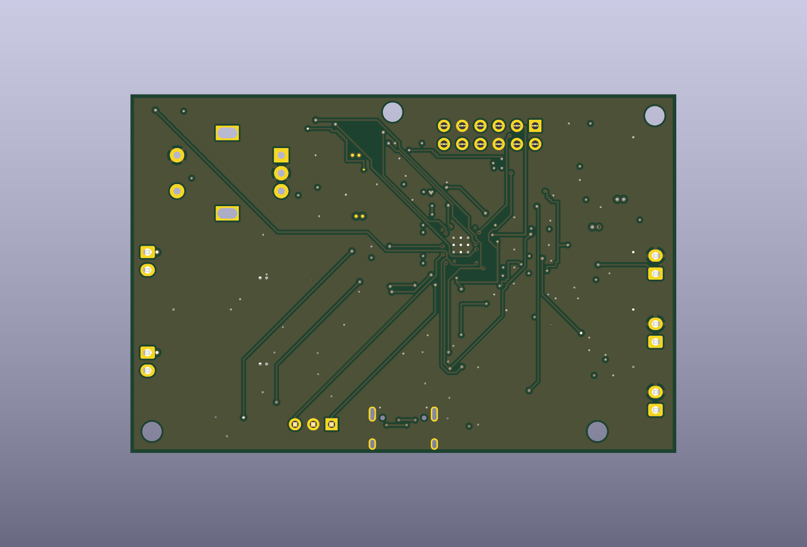
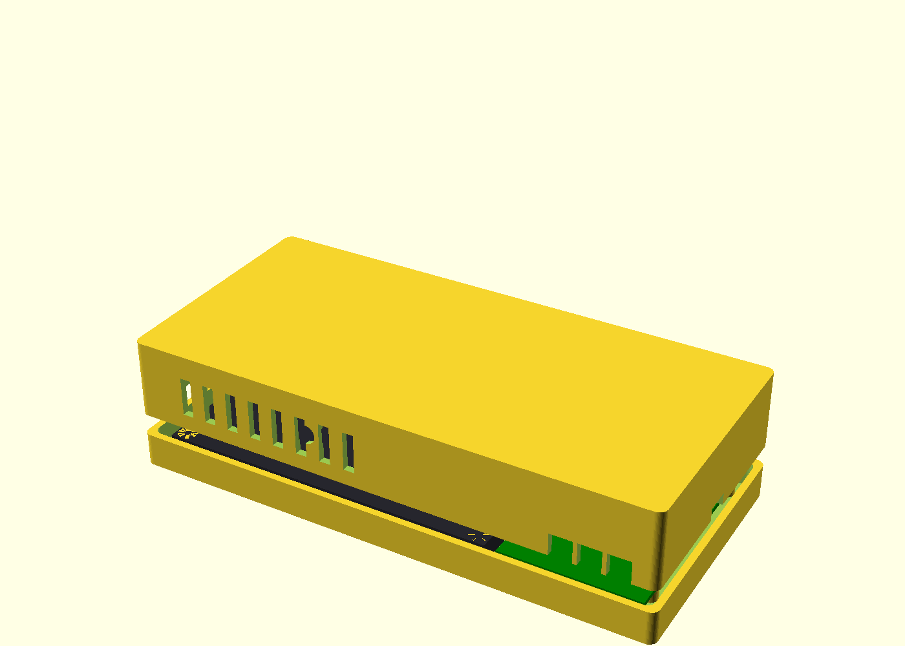

# WiggleCam Camera Controller

The RP2040 board that handles timing-critical and analog work for a
[4-lens camera](https://github.com/jadenrhee/wigglecam). The Raspberry
Pi runs capture and image processing, but Linux is not a real-time OS
and the Pi can't drive the flash directly.

This board runs the LED flash at constant current, with the limits set
in the circuit rather than only in firmware. It also debounces the
shutter, decodes the EC11 encoder, and monitors battery voltage and
current through an INA219. On a trigger it pulses the Pi the instant the
LEDs reach full current.

The Pi drives it over I2C at 0x17, and the capture pulse returns on its
own GPIO line. The 2x6 header maps 1:1 onto Pi 5 GPIO pins 1 to 12.

Not fabricated yet, so everything here comes from the design files.

Signal routing, front copper red and back copper blue, planes hidden:

| | |
|---|---|
| Board | 76 x 50 mm, 4 layers |
| Schematic | ERC clean, 0 errors and 0 warnings |
| Layout | DRC clean, 0 violations and 0 unconnected, against JLCPCB's published 4-layer rules |
| Verification | 24 checks measured off the finished layout, no failures. [Report](docs/verification-report.md) |
| Firmware | builds clean under the Pico SDK |
| Fab outputs | Gerbers, drill, BOM, and placement files in [fab/](fab/) |

## Repo layout

| Path | Contents |
|------|----------|
| [hardware/skidl/](hardware/skidl/) | schematic as code, the source of record |
| [hardware/scripts/](hardware/scripts/) | board generation, fab output, and verification tooling |
| [hardware/kicad/](hardware/kicad/) | the board file and custom footprints |
| [hardware/partlist.md](hardware/partlist.md) | every part, the reasoning behind it, and where to order it |
| [fab/](fab/) | Gerbers, Excellon drill, `bom.csv`, `cpl.csv`, renders |
| [firmware/](firmware/) | C firmware: I2C register file, flash safety logic, INA219, EC11, WS2812 |
| [enclosure/](enclosure/) | 3D-printable pod holding the screen, this board, and the Pi 5 |
| [docs/](docs/) | [verification report](docs/verification-report.md), [design rationale](docs/design-rationale.md), and the [Pi protocol](docs/protocol.md) |

