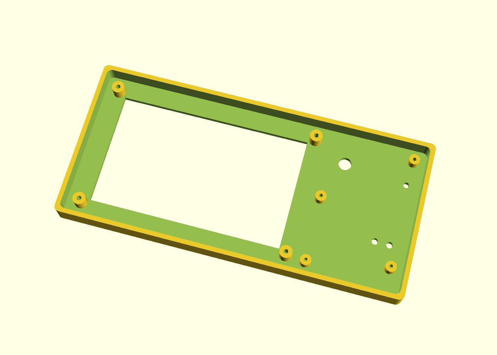
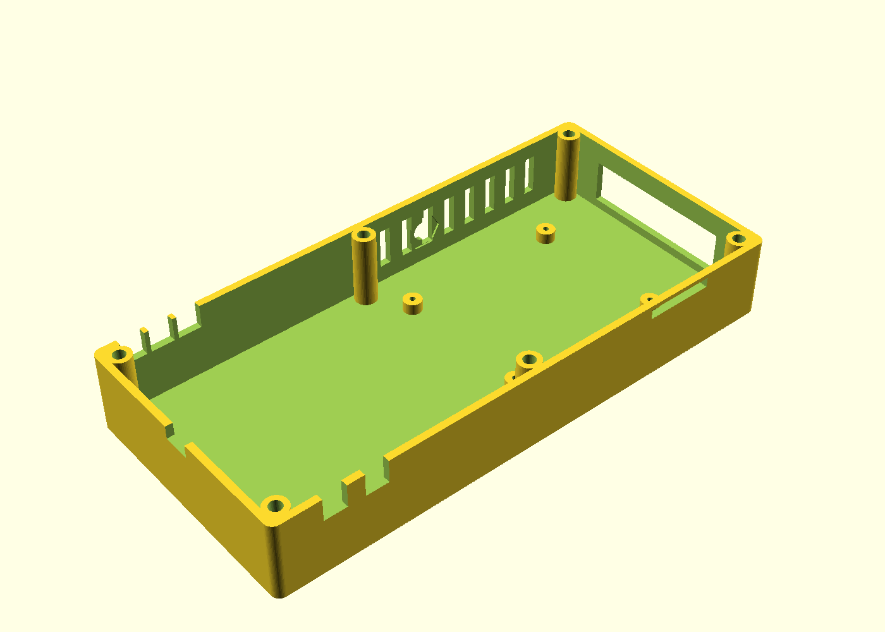

# Control pod enclosure

Two-shell 3D-printable case (≈191 × 89 × 40 mm) housing the camera's
brain: the 4.3" DSI touchscreen behind the left of the face, this
repo's controller PCB behind the right-hand control strip (components
facing out — encoder knob, status-LED light pipe and BOOTSEL/RUN
poke-holes come through the face; USB-C exits the right wall), and a
Raspberry Pi 5 flat on the rear floor.





**The PCB cannot mis-mate:** every board-related feature (mounting
bosses, encoder hole, LED pipe, button holes, USB-C window, cable
slots) is generated from the routed `.kicad_pcb` via
`hardware/scripts/08_enclosure_dims.py` → [board_dims.scad](board_dims.scad).
If the layout ever changes, re-run the extractor and re-export.

## Ordering prints (no printer needed)

Upload `stl/pod_front.stl` and `stl/pod_back.stl` to any of:

- **[JLC3DP](https://jlc3dp.com)** — cheapest; pick **SLS Nylon
  (PA12)** for a clean, strong student-budget result (~$15–25 for the
  pair), or resin if you want smoother faces.
- **[Craftcloud](https://craftcloud3d.com)** — price-comparison
  across many services.
- A **library / school makerspace** FDM printer also works: PETG,
  0.2 mm layers, 4 walls, 25 % infill; print both shells face-down
  (flat side on the bed), no supports needed except the side windows
  (bridging distance is small enough for a tuned printer).

**Before ordering**, measure your delivered screen with calipers and
update `scr_*` in [control_pod.scad](control_pod.scad) — the
Waveshare 4.3" module outline/hole values here are typical but marked
`TODO(measure)` because vendor revisions drift.

## Assembly hardware

| Item | Qty | Use |
|------|-----|-----|
| M3 heat-set inserts + M3×12 screws | 6 | join the shells |
| M2×6 self-tapping screws | 4 | controller PCB onto its bosses |
| M2.5×6 self-tapping screws | 4 | Pi 5 onto the floor bosses |
| M3×6 self-tapping screws | 4 | screen module |
| 3 mm acrylic rod, ~6 mm piece | 1 | WS2812 light pipe (press-fit, dab of CA glue) |
| 12-way 2.54 mm ribbon, 2×6 IDC both ends, ~80 mm | 1 | controller J8 → Pi GPIO pins 1–12 |
| Knob for 6 mm D-shaft | 1 | encoder |
| The encoder's own M7 nut + washer | — | clamps the PCB assembly to the face |

## Assembly order

1. Heat-set the six M3 inserts into the back-shell towers.
2. Press the light pipe into the face from inside; trim flush.
3. Screw the controller PCB (components toward the face) onto its
   four bosses; add the encoder washer + nut on the outside; fit the
   knob.
4. Screw the screen into its pocket; route its DSI cable.
5. Screw the Pi onto the floor bosses (active cooler up); connect
   DSI to the screen, the 12-way ribbon to the controller, and the
   camera ribbon through the top slit.
6. Route the JST harnesses (LED ×2 top, VBAT ×2 + shutter bottom)
   through their slots before closing.
7. Close the shells, six M3 screws. The 1/4-20 nut epoxies into the
   bottom pocket for tripod use.

## Regenerating

```bash
# dimensions from the PCB (KiCad's bundled python):
KIPY hardware/scripts/08_enclosure_dims.py
# STLs + renders:
OpenSCAD -o enclosure/stl/pod_front.stl -D 'PART="front"' enclosure/control_pod.scad
OpenSCAD -o enclosure/stl/pod_back.stl  -D 'PART="back"'  enclosure/control_pod.scad
```
